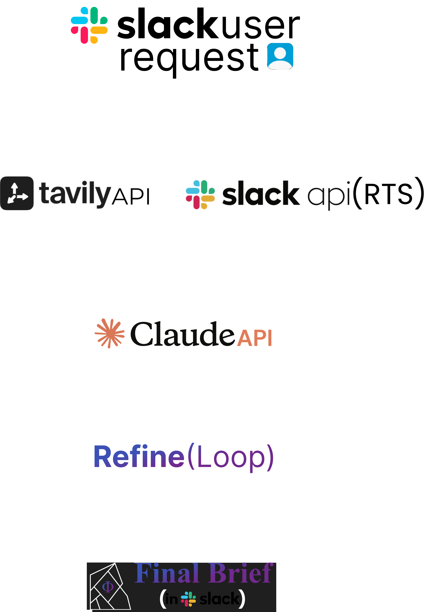

# BriefAgent

**AI-powered research brief assistant for Slack.**

BriefAgent is a Slack AI agent that generates decision-ready business research briefs by combining your team's internal Slack context with live external web data — synthesized by Claude into a structured, professional brief in seconds.

Built for the [Slack Agent Builder Challenge](https://slackhack.devpost.com/) on Devpost.

---

## What It Does

Type any topic directly into BriefAgent inside Slack — a company, market, policy, or question — and receive a structured research brief that includes:

- **Internal context** — relevant messages and discussions your team has already had about the topic, pulled via Slack's Real-Time Search API
- **External context** — live market data, news, and competitor information from the web via Tavily
- **Claude synthesis** — both sources combined into a clean, analyst-quality brief

From there, refine the brief through natural conversation, then export it as a PDF or TXT file.

---

## Demo

[[Link to demo video](https://youtu.be/J3FRFRn1M-E)]

---

## Architecture


---

## Tech Stack

| Technology | Role |
|---|---|
| Slack Bolt for Python | App framework, assistant thread handling, Socket Mode |
| Slack Real-Time Search API | Pulls internal workspace messages relevant to the topic |
| Tavily Search API | Fetches live external web data — market stats, news, competitor info |
| Claude API (Anthropic) | Synthesizes internal + external context into a structured brief |
| ReportLab | PDF generation for brief export |
| Python 3.13 | Backend language |

---

## Features

- **Direct chat interface** — open BriefAgent in the Slack sidebar and type any topic
- **Dual-source research** — internal Slack context + live web data in every brief
- **Structured output** — Executive Summary, Why It Matters, Internal Context, External Context, Key Insights, Risks, Recommendations, Next Steps
- **Refinement loop** — refine the brief through conversation ("make it shorter", "focus on risks", "slide-ready version")
- **PDF export** — download a professionally formatted PDF brief
- **TXT export** — plain text version for quick copy-paste
- **Suggested prompts** — contextual prompts that update based on where you are in the flow

---

## Setup

### Prerequisites

- Python 3.10+
- A Slack Developer Sandbox ([get one here](https://slack.dev))
- Anthropic API key ([console.anthropic.com](https://console.anthropic.com))
- Tavily API key ([app.tavily.com](https://app.tavily.com))

### Installation

**1. Clone the repo**
```bash
git clone https://github.com/Sanjitkadam1/briefagent.git
cd briefagent
```

**2. Set up virtual environment**
```bash
# Windows
python -m venv venv
venv\Scripts\activate

# Mac/Linux
python3 -m venv venv
source venv/bin/activate
```

**3. Install dependencies**
```bash
pip install -r requirements.txt
```

**4. Configure environment variables**
```bash
cp .env.sample .env
```

Fill in your `.env`:
```
SLACK_BOT_TOKEN=xoxb-...
SLACK_SIGNING_SECRET=...
SLACK_APP_TOKEN=xapp-...
SLACK_APP_ID=A0...
ANTHROPIC_API_KEY=sk-ant-...
TAVILY_API_KEY=tvly-...
```

**5. Configure your Slack app**

Go to [api.slack.com/apps](https://api.slack.com/apps) and create a new app. Enable:
- Socket Mode
- Agent or Assistant (under Agents & AI Apps)
- Event Subscriptions — subscribe to: `assistant_thread_started`, `message.im`, `app_home_opened`, `app_mention`

Add these bot scopes under OAuth & Permissions:
```
assistant:write
canvases:write
channels:history
chat:write
chat:write.public
commands
files:write
im:history
im:read
im:write
app_mentions:read
```

Reinstall the app to your sandbox workspace and update `SLACK_BOT_TOKEN` in `.env`.

**6. Run**
```bash
python app.py
```

---

## Usage

1. Open BriefAgent from the Apps section in your Slack sidebar
2. Type any topic — `NVIDIA market trends`, `Fed rate decision`, `EV market overview`
3. BriefAgent researches internally and externally, then posts a structured brief
4. Refine through conversation — `make it shorter`, `focus on risks`, `slide-ready version`
5. Click **Download PDF** or **Download TXT** to export

---

## Project Structure

```
briefagent/
├── app.py                          # Entry point, Bolt app setup
├── agent/
│   ├── research.py                 # Core pipeline: RTS + Tavily + Claude
│   ├── state.py                    # In-memory session management
│   ├── pdfexport.py                # PDF generation and upload
│   └── txtexport.py                # TXT generation and upload
├── listeners/
│   ├── __init__.py                 # Listener registration
│   ├── actions/
│   │   └── __init__.py             # Button action handlers
│   ├── events/
│   │   ├── assistant_thread_started.py
│   │   ├── assistant_message.py
│   │   ├── app_home_opened.py
│   │   └── app_mentioned.py
│   └── views/
│       └── app_home_builder.py     # App Home Block Kit layout
├── prompts/
│   ├── system_prompt.txt           # Claude persona and rules
│   ├── user_prompt.txt             # Brief generation template
│   └── refinement_prompt.txt       # Refinement instruction template
├── search.py                       # Tavily integration
├── .env.sample                     # Environment variable template
└── requirements.txt
```

---

## Team

- **Sanjit** — architecture, assistant thread integration, RTS API, state management, PDF export, prompt engineering
- **[Collaborator]** — Tavily integration, slash command, Claude synthesis

---

## Track

New Slack Agent — [Slack Agent Builder Challenge](https://slackhack.devpost.com/)

---

## License

MIT